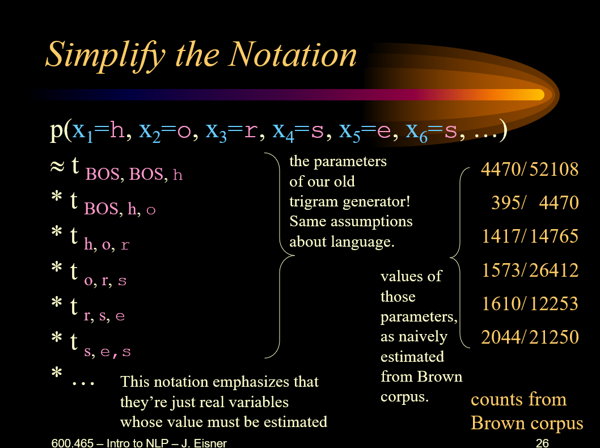
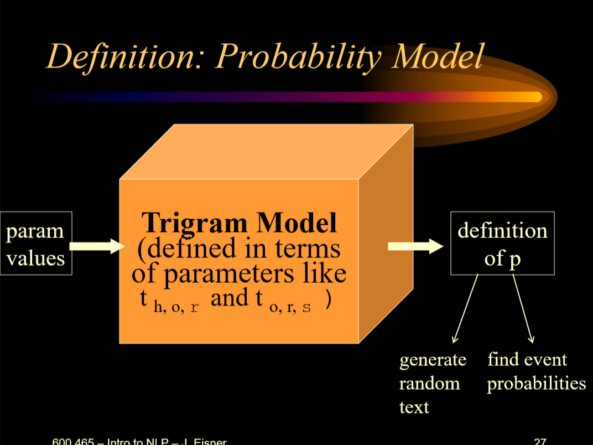
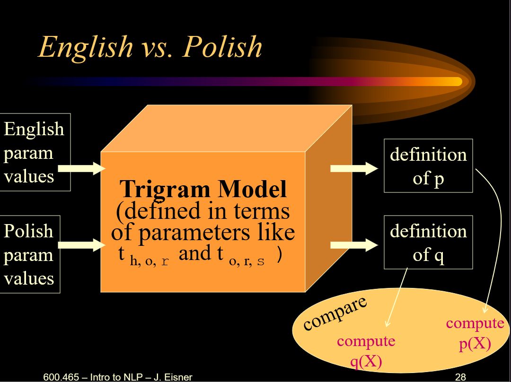
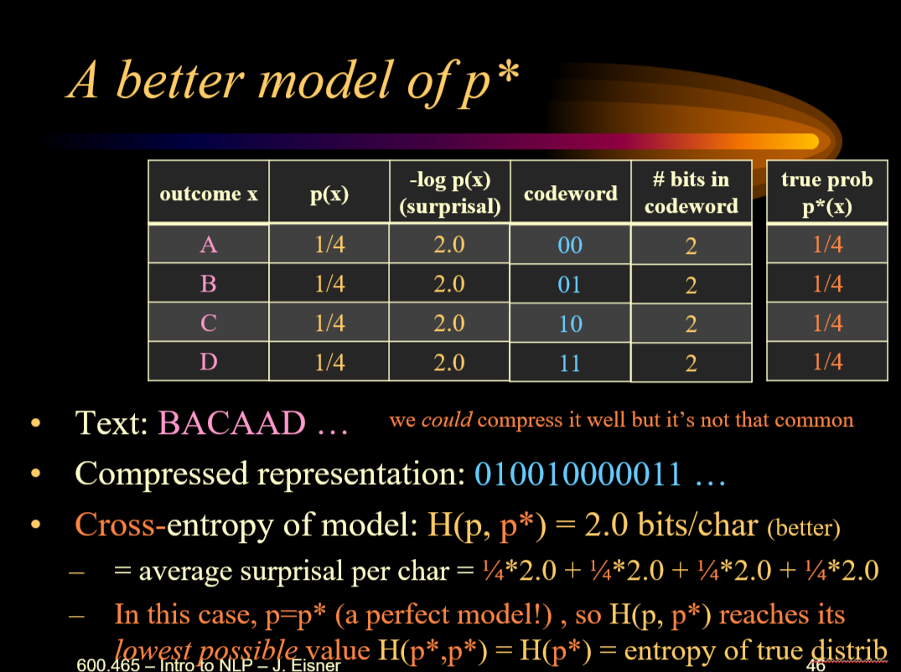
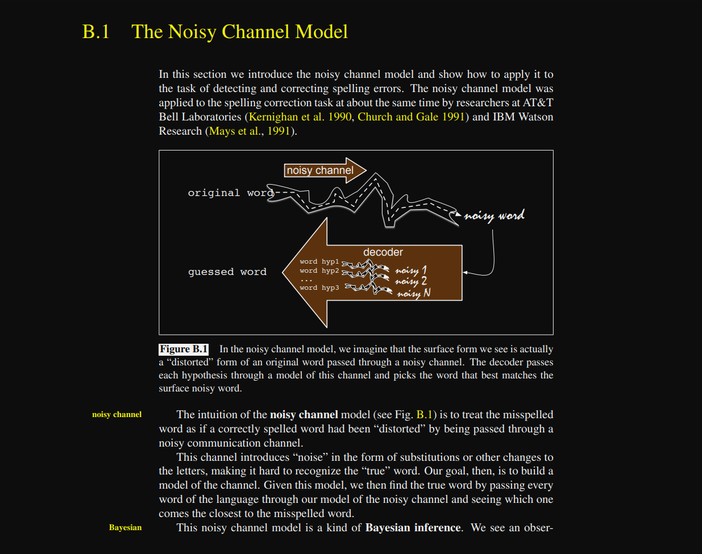

# Week 2: Lecture 4-5

## Lecture 4a

**Probability Notation**: $p(A|B)$ (signifies prob of A given B). p measures total probability of a set of outcomes (an “event”).

Properties of P (axioms):

1. $p(\emptyset) = 0$
2. $p(X) \leq p(Y) \text{ for any set } X \subseteq Y = 0$
3. $p(X \text{ and } Y) = p(X) + p(Y) \ \text{if} \ p(X \text{ or } Y) = 0$ (mutully exclusive)
4. $p(X \ and \ \neg Y) + p(X \ and \ Y) = p(X)$

Adding to conditions:

- Given P(A|B), adding more to the left always **decreases** probability, i.e. P(A, Z|B) <= A(A|B).

- Given P(A|B), adding more to the right could increase or decrease probability, i.e. $P(A|B, Z) >< P(A|B)$. This has **Lower Bias, Higher Variance**.

**Back-off** is when we reduce variables from the *right side* of the `|` pipe operator. This makes it possibe for us to estimate probabilities and get a rough estimte. Back-off **reduces our Variance but incease the Bias** of our probability estimation.

**Chain Rule** is when we reduce variables to the *left side* of the `|` pipe operator. This makes it possibe for us to break down larger estimates into smaller probabilities.

$$P(A, B, C, D|Z) = P(A|B, C, D, Z) * \\ \ \ \ \ \ \ \ \ \ \ \ \ \ \ \ \ \ \ \ \ \ \ \ \ \ \ \ \ \ P(B|C, D, Z) *\\ \ \ \ \ \ \ \ \ \ \ \ \ \ \ \ \ \ \ \ \ \ \ \ \ P(C|D, Z) *\\ \ \ \ \  \ \ \ \ \ \ \ \ \ \ \ \  P(D|Z)$$

Now we can use Chain Rule + Backoff (now that chain rule sends probs to the right of `|`) to simplify the above equation even further:

$$P(A, B, C, D|Z) = P(A|Z) * \\ \ \ \ \ \ \ \ \ \ \ \ \ \ \ \ \ \ \ \ \ \ \ \ \ \ \ \ \ \ \ \ \ \ \ P(B|Z) *\\ \ \ \ \ \ \ \ \ \ \ \ \ \ \ \ \ \ \ \ \ \ \ \ \ \ \ \ \ \ \ \ \ \ \ P(C|Z) *\\ \ \ \ \ \ \ \ \ \ \ \ \ \ \ \ \ \ \ \ \ \ \ \ \ \ \ \ \ \ \ \  P(D|Z)$$

if P(A, B, C, D|Z) remain unchanged after backing off we can say that A is **Conditionally Independent** of B, C, and D.

### Modeling Language

Given that we want to model language:

$$
P(sentence=X) = \text{Probability of X being English}\\
Q(sentence=X) = \text{Probability of X being Polish}
$$

Sentence (sequence to tokens) = {$BOS, w_1, w_2, w_3, w_4, w_5..., w_n, EOS$}

uisng Chain rule to expand probability o sentence being English

$$
P(w_1, w_2, w_3,...) = P(w_1)*
P(w_2|w_1)*
P(w_3|w_1, w_2)*
P(w_4|w_1, w_2, w_3)*
...
$$

but the above probability becomes 0 as we increase the evidence (tokens to the right of |). hence we apply backoff to make a trigram model:

$$
P(w_1, w_2, w_3,...) = P(w_1)*
P(w_2|w_1)*
P(w_3|w_1, w_2)*
P(w_4|     w_2, w_3)*
...
$$

We also condition that our first token is preceded by $BOS$ (beginning of sequence) token and our sequence ends ith $EOS$ (end of sequence).

$$
P(w_1, w_2, w_3,...) = P(sentence) = \\
P(w_1|BOS, BOS) * P(w_2|BOS, w_1) * P(w_3|w_1, w_2) * ... * P(EOS|w_{n-1}, w_n)
$$

We can estimate a word a sequnce of characters and estimate it similarly.

Word (sequence to tokens) = {$BOS, c_1, c_2, c_3, c_4, c_5..., c_n, EOS$}

$$
P(word) = P(c_1|BOS, BOS) * P(c_2|BOS, c_1) * ... * P(EOS|c_{n-1}, c_n)
$$

### Probability Model

model definition:

- Generates Random Sentence
- Finds Event Probabilities

p(X) is the probability of a random variable where X is a variable that is a function on outcome space.

### Directed Modeling

french to english translation $P(e|f)$, where $P(e,f)$ is the actual distribution over pairs. Hence we can create a direct model of french to english with $P(e|f)$ as the Posterior probability where the likelihood $P(f|e)$ models the Adequecy of a specific translation (translate and reorder) and $P(e)$ (n-gram) judges Fluency.

### Measure Performance

Split data into train and test

#### Cross-Entropy (aka `xent` or `log-loss`)

This is a measure of model performance through probability. xent is the average **"surprisal"** where smaller is better (when p(x) is high surprisal us low). surprisal is given by:

negative log-probability (**"surprisal"**) = $-log(p(x))$

Total Cross-Entropy of a corpus remains constant. If a corpus has `N` words and the average size of a word is 6 letters then the corpus has `6N` letters. Thus:

$$\text{Cross-Entropy of Corpus} = N * \text{Cross-Entropy per word} = 6 \cdot N \cdot \text{Cross-Entropy per letter}$$

#### Huffman Code

With Huffman code # bits = surprisal = $-log(p(x))$

For a given model, calculating avg surprisal for estimated and true probabilities:

$$ H(p) = Entropy = Avg \ Surprisal \ per \  character = \sum p(x) * (-\log p(x)) $$

$$ H(p, p_hat) = Cross-Entropy = Avg \  Surprisal \ per \ character = \sum \hat{p}(x) * (-\log p(x)) $$

Where, $p(x)$ is the estimated probability by the model and $p_hat(x)$ is the true probability. It is a perfect model (lowest cross-entropy value) when p = p_hat. Hence, lower limit of entropy is the true distribution.

Improvements on surprisal for trigrams or language models in general:

- Take log with base 2 to prevent overflow
- Negate log to get positive Bits
- Divide by length of text (or word)

Perplexity = $2^{surprisal}$

## Lecture 4b

$$Bayes theorum: P(A|B) = { P(A) * P(B|A) \over P(B) }$$

Definitions:

- P(A|B): Posterior
- P(A): Prior (Passed into a Noisy Channel Model) (Also forms our language model)
- P(B|A): Likelihood (Given by a Noisy Channel)
- P(B): Normalization Factor

$P(B)$ can be estimated over all joint probability:

$$ P(B) = P(B, A_1) + P(B, A_2) + P(B, A_3) $$

if A_1 + A_2 + A_3 = the entire set of priori, if there is only 1 A that we know:

$$ P(B) = P(B, A) + P(B, \not A) $$

Bayes theorum can be uses for:

- Converting between P(A|B) and P(B|A)
- Updating Priori P(A) to P(A|B) given new evidence P(B)

$$ P(sentence=x|labguage=english) = P_{english}(sentence=x) $$

### Noisy Channel

**Noisy Channel** Maps A to B and a **Decoder** creates the most likely reconstruction of A from B.

Given Posterori ration becomes skewed towards the outcome that is favoured by the likelihood ratio as priori ratio remains the same.

Noisy channels the likelihood `p(B|A)`, derived from the initial event that is our prior `p(A)`, both of these terms are finally combined to create our posterior probability `p(A|B)`.

The type of maximization that happens in a Noisy Channel is called Decoding.

## Extraa Reading: Probability Basics

## Lecture 5a : Smoothing

### Smoothing

Relative frequency estimation can be harmful, if we see something happen 0 out of 3 times it does not mean that the event is impossibe. **Smoothing** is used to reduce this risk.

A **word type** is a disinct vocabulary item, where a **token** is an occurance of that type.

Dictionary = list of Word Types
Corpus = List of Tokens

We estimate the proability of dictionary types using counts of corpus tokens. But some probabilities could become 0 just becase those specific tokens were not found in the corpus but the tokens can still be found. hence, Positive counts need to be discounted (reduced) and reallocated to zero probabilities (especially if deonominator or numerator is small)

### Add-1 Smoothing

Add 1 to the counts of all sequences. More the observations, lesser the overall effect of smoothing without taking out specific poabilities.

Smoothibng heuristics is an estimator for probabilities. For a dictionary with a large number of word types and lots of Novel (never seen before) events, Add-1 smoothing startes making Novel events extremly likely (same as non-novel events).

### Add-lambda (λ) Smoothing

To alleviate the problem discussed above we use add-λ smoothing, this gives a lower probability to novel events.

if λ is too small we dont smooth much, **High Variance**. if λ is too high we smooth too much, **High Bias**. Smoothing reduces Variance.

for Unsmoothed estimates:

Estimates that are correct on average = Low Biased
Such estimate are far from truth = High Variance

for Smoothed estimates:

Estimates that are incorrect on average = High Biased
Such estimate are closer to truth = Low Variance

High Smoothing = Underfit (Ignore Data)
No Smoothing = Overfit (Memorized Data)

λ is a hyperparameter that can be seleted, we create a (hold-out) validation set from 20% of the train data and calculate the best value for λ.

### 5-fold Cross-Validation (Jackknifing)

if one single 20% validation set too less creat 5 such sets each of 20% data and pick λ that performs best on average.

### N-fold Cross-Validation (Leave One Out)

Same as 5-fold but instead of dividing trainig set into 5 parts we find best λ for each sentence. Ths method is also very fast.

### Back-off + Smoothing

Smoothing reduces Variance so does Backoff. Some unigrams are more probable than the others. Using both together gives a weighted average.

Before, we were averaging the trigram relative frequency estimate with the uniform distribution. Now we’re averaging it with the “backed-off” (bigram) distribution.

***Backoff Smoothing as model averaging:***

$$
\hat{p}(a|c,b) = \alpha \cdot p(a|c,b) + (1-\alpha) \cdot \hat{p}(a|b) \\
where \ \alpha = \frac{count(b,c)}{count(b,c) + \lambda \cdot V}
$$

Before, we were averaging the **trigram relative frequency estimate** with the **uniform distribution**. Now we’re averaging it with the **“backed-off” (bigram) distribution**. Backed-off distribution is itself just an estimate, but a pretty good one:

- Close to what we want since it still considers 2 of the 3 words (**low bias**)
- Based on more data (**low variance**)
- We can estimate it by backing off to unigram distribution, in turn (**lowers variance more**)

### Jelinel-Mercer Smoothing

This is also called "deleted interpolation", where we use a weighted avergae of the backed-off naive models:

$$
\hat{p}_{average}(a|c,b) = \mu_3 \cdot \hat{p}(a|c,b) + \mu_2 \cdot \hat{p}(a|b) + \mu_1 \cdot \hat{p}(a)\\
where \ \mu_1 + \mu_2 + \mu_3 = 1 \ and \ (0 \le \mu \le 1)
$$

The weights $\mu$ can depend on the context of $c \ and \ b$. If we have “enough data” in context $c \ and \ b$, can make $\mu_3$ large.  E.g.:

- If $count(c, b)$ is high
- If the entropy of z is low in the context xy

Learn the weights on held-out data w/ jackknifing. Different $\mu_3$ when $c \ and \ b$ is observed 1 time, 2 times, 3-5 times, $\dots$

### More Techiques

Cross-validation is a general-purpose wrench for tweaking **any** constants in **any** system. Here, the system will train the counts from **Train** data, but we use **Dev** data to tweak how much the system smooths them ($|\lambda$) and how much it backs off for different kinds of contexts ($\mu_3$ etc.)

Det (Determiners): Closed Class (fixed)
N (Noun): Open Class (unfixed)

T: Total Types of tokens
N: Total Number of tokens

T == N for singletons and T < N for all other cases

#### Witten-Bell Smoothing Ideas

#### Good Tuning Smoothing Ideas

#### Good Tuning vs Witten Bell

## Lecture 5b : Log-Linear Models

We’ve been estimating conditional probabilities using modified count ratios. Instead, maybe we could find a formula that yields conditional probabilities, and estimate the parameters (numbers) that appear in that formula.

In fact, optimize them!  Not to make the probabilities individually good, but to ensure that together, they achieve good cross-entropy or task performance.

### Conditional Modeling

### Linear Scoring

### Features to Use

### Log-Linear COnditional Probability

### Trainig $\theta$

### Gradient Based Trainig

### Maximizing Entropy
