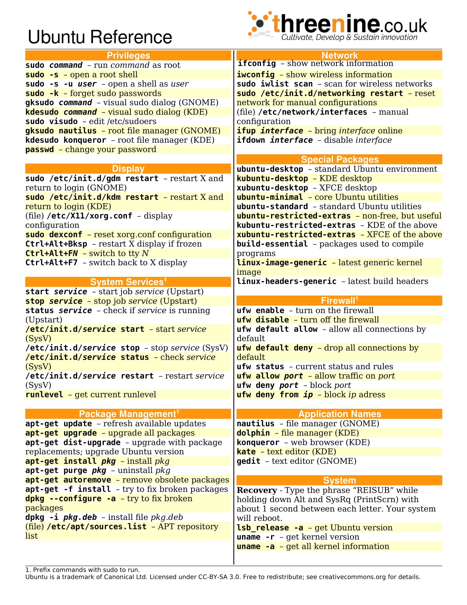
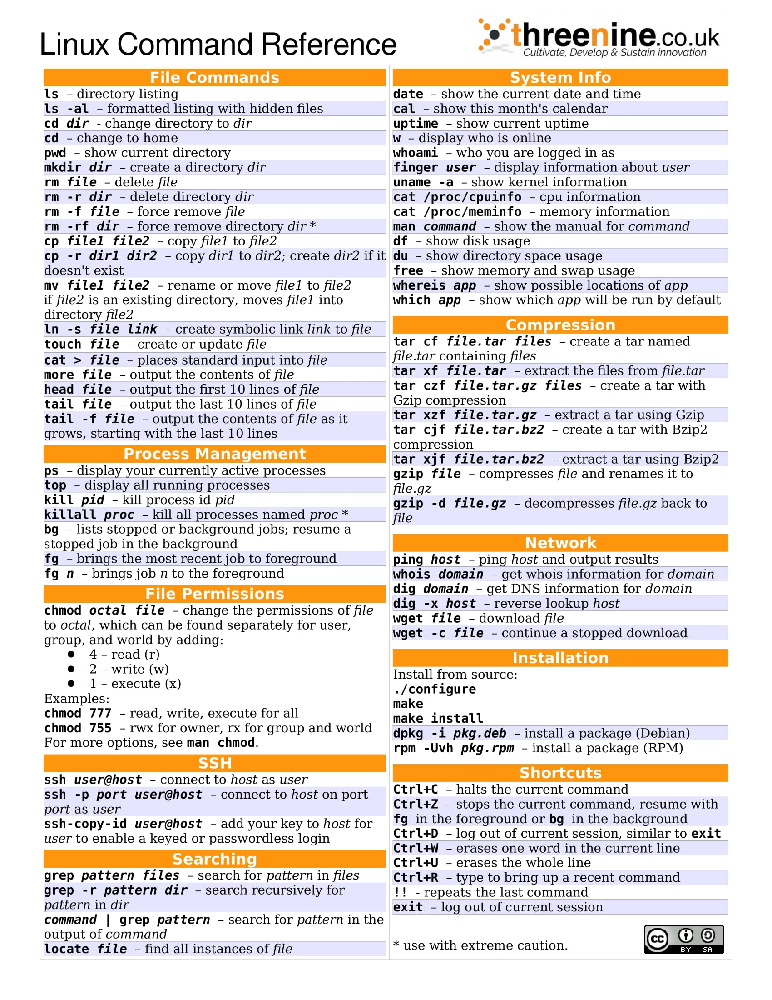

# Linux Basics

Reasons to learn Linux to learn Docker:

1. Docker has its foundations built on top of basic linux concepts, so some knowledge of the basic linux commands is needed to be productive and troubleshoot issues easily.
2. most tutorials online are based on linux commands.
3. Everybody should know some Linux but you don't need to write a book on it.

## Linux Distributions (distros)

**Linux distributions** also called `Linux distros`. Linux is an open source software and for this reason many individuals and communities have created their own version of linux called linux distributions each of these distributions is made to fit specialized needs like running servers, desktop, computers, mobile phones, and so on.

Pupular Linux DIstros:

- `Ubuntu`
- `debian`
- `fedora`
- `centos`
- `alpine` (a very lightweight linux distribution).

There are more than a 1,000+ linux distributions out there now most of these distributions support muchof the same set of commands but sometimes you might discover differences along the way so be aware of that.

to run the linux image locally on your device execute the command `docker run -it alpine` (or Ubuntu). This command creates a container of the linux distro if you have it available offline otherwise it downlods it from one of [THESE](https://hub.docker.com/search?q=linux) (depending on your requested distro).

## Command Line Arguements

## Managing Packages

Development platforms come with a package manager (eg: npm, yarn, pip), in ubuntu we also have a package manager called `apt` which is short for **advanced package tool**. `apt` is a command-line utility for installing, updating, removing, and otherwise managing packages on Ubuntu, Debian, and other related ***Debian-Based-Linux*** distributions.

For more information on teh Linux package manage. Check this out: [CLICK HERE](https://itsfoss.com/apt-command-guide/).

## Linux File System

the file system includes files like:

- bin
- boot
- dev
- etc
- home
- root
- lib
- var
- proc

In linux just like windows, files and directories are organized an a `tree` in a *hierarchical structure*. In windows we have a structure like this with `C:` drive on top of the hierarchy then below that we have directories like `program files`, `windows` etc. In linux we have the `root` directory on top of the hierarchy followed by standard directories such as `bin` which includes binaries or programs we have boot which includes all the files related to booting then we have `dev` (short for devices).

In linux everything is a file including `devices` `directories` `network sockets pipes` and so on so the files that are needed to access devices are stored in this directory. Then we have `etc` (short for editable text configuration) so this is where we have configuration files. `home` is where home directories for users are stored so on a machine with multiple users. `root` which is the home directory of the root user. Only the root user can access this directory then we have `lib` which is used for keeping library files like software library dependencies. we have `var` (short for variable) and this is where we have files that are updated frequently like *log files*, *application data* etc. Finally we have `proc` which includes files that represent running processes.

In linux everything is a file like processes, devices, and even directories are files.

For more information: [CLICK HERE](https://www.linuxfoundation.org/blog/blog/classic-sysadmin-the-linux-filesystem-explained)

## Some more important links for the linux system

- [Naigating the File System](https://www.skysilk.com/blog/2019/navigating-linux-file-system/)
- [Manipulating FIles and Directories](https://linuxcommand.org/lc3_lts0050.php)
- [Editing and Viewing files](https://www.hivelocity.net/kb/how-to-open-edit-move-and-copy-a-file-in-linux/)
