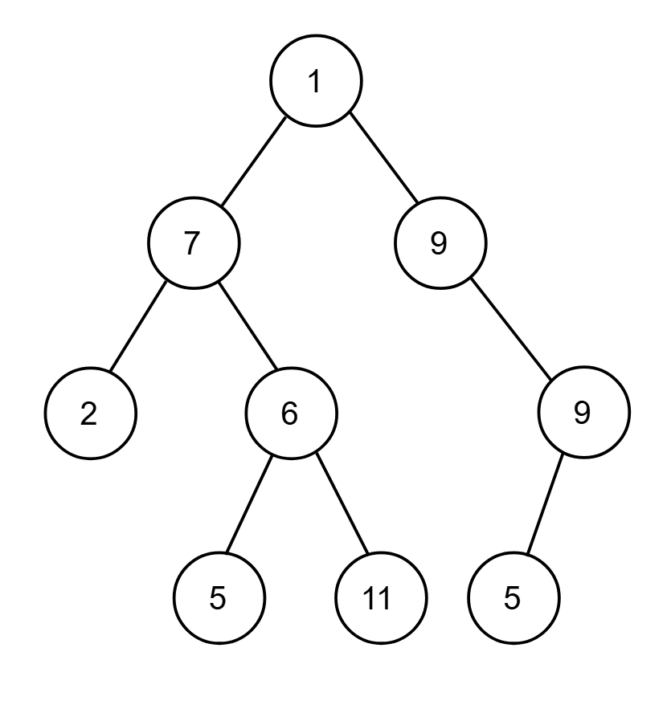

# 🌳 Tree Cheatsheet for Coding Interviews

## Introduction

A **tree** is a fundamental abstract data type that represents a hierarchical structure. It consists of a set of connected **nodes**, where each node can have multiple children but only one parent, except for the **root** node, which has no parent. Trees are a special type of graph: they are **undirected**, **connected**, and **acyclic** (no cycles).

For interviews, you'll most often encounter **binary trees** (max two children) and **binary search trees (BSTs)**. They are excellent for representing hierarchical data like file systems, JSON objects, and HTML documents.

---

## Key Terminology

- **Neighbor**: The parent or a child of a node.
- **Ancestor**: A node that can be reached by repeatedly moving from a node to its parent.
- **Descendant**: A node in a given node's subtree.
- **Degree**: The number of children a node has.
- **Level / Depth**: The number of edges on the path from the root to a node. The root is at level 0.
- **Width**: The number of nodes at a particular level.
- **Distance**: The number of edges along the shortest path between two nodes.

---

## Binary Trees

A binary tree is a tree where each node has at most two children, referred to as the **left child** and the **right child**.

### Types of Binary Trees

- **Complete Binary Tree**: A binary tree where every level, except possibly the last, is completely filled. All nodes in the last level are as far left as possible.
- **Balanced Binary Tree**: A binary tree where the height of the left and right subtrees of any node differs by no more than 1. This property is crucial for ensuring efficient operations.

---

## Tree Traversals 🚶‍♂️

Traversing a tree means visiting every node exactly once. There are two main approaches: Depth-First Search (DFS) and Breadth-First Search (BFS).



```txt
    1
   / \
  7   9
 / \  / \
2  6 9   5
  / \
 5  11
```

### Depth-First Search (DFS)

DFS explores as far as possible down each branch before backtracking. It's commonly implemented using recursion.

#### Pre-order Traversal (Root → Left → Right)

Visits the current node first, then left subtree, then right subtree.

- **Example Result**: `1, 7, 2, 6, 5, 11, 9, 9, 5`

##### Preorder Recursive

```python
def preOrder_recursive(node, array=None):
    if array is None:
        array = []
    if node is not None:
        array.append(node.value)
        preOrder_recursive(node.left, array)
        preOrder_recursive(node.right, array)
    return array
````

##### Preorder Iterative

```python
def preOrder_iterative(root):
    if root is None:
        return []
    stack, output = [root], []
    while stack:
        node = stack.pop()
        output.append(node.value)
        # Push right first so left is processed next
        if node.right:
            stack.append(node.right)
        if node.left:
            stack.append(node.left)
    return output
```

---

#### In-order Traversal (Left → Root → Right)

Recursively traverse left, visit node, then traverse right.

- **Example Result**: `2, 7, 5, 6, 11, 1, 9, 5, 9`

##### Inorder Recursive

```python
def inOrder_recursive(node, array=None):
    if array is None:
        array = []
    if node is not None:
        inOrder_recursive(node.left, array)
        array.append(node.value)
        inOrder_recursive(node.right, array)
    return array
```

##### Inorder Iterative

```python
def inOrder_iterative(root):
    stack, output = [], []
    current = root
    # Traverse until all nodes are processed
    while stack or current:
        # Reach the leftmost Node
        while current:
            stack.append(current)
            current = current.left
        # Current is None at this point
        node = stack.pop()
        output.append(node.value)
        # Visit the right subtree
        current = node.right
    return output
```

---

#### Post-order Traversal (Left → Right → Root)

Traverse left subtree, right subtree, then visit the node.

- **Example Result**: `2, 5, 11, 6, 7, 9, 5, 9, 1`

##### Postorder Recursive

```python
def postOrder_recursive(node, array=None):
    if array is None:
        array = []
    if node is not None:
        postOrder_recursive(node.left, array)
        postOrder_recursive(node.right, array)
        array.append(node.value)
    return array
```

##### Postorder Iterative (two‑stack method)

```python
def postOrder_iterative(root):
    if root is None:
        return []
    stack1, stack2 = [root], []
    # Process all nodes
    while stack1:
        node = stack1.pop()
        stack2.append(node.value)
        # Push left first so right is processed before left
        if node.left:
            stack1.append(node.left)
        if node.right:
            stack1.append(node.right)
    # stack2 has root→right→left order, so reverse it
    return stack2[::-1]
```

### Breadth-First Search (BFS) / Level-Order Traversal

BFS explores nodes level by level, from left to right. It is typically implemented with a **queue**.

- **Example (Top‑Down) Result**: `[[0], [1,7], [2,6,8,3], [4,5]]`
- **Python Code**:

    ```python
    def levelOrder(root: TreeNode) -> list[list[int]]:
        if root is None:
            return []
        
        results = []
        queue = [root]

        while queue:
            level_size = len(queue)
            current_level = []
            for _ in range(level_size):
                node = queue.pop(0)
                current_level.append(node.val)
                if node.left:
                    queue.append(node.left)
                if node.right:
                    queue.append(node.right)
            results.append(current_level)
            
        return results
    ```

#### Reverse Level-Order Traversal (Bottom‑Up)

Traverse the tree level by level **from the bottom up**. You can either build the top‑down result and reverse it at the end, or **prepend** each level as you go.

- **Example (Bottom‑Up) Result**: `[[4,5], [2,6,8,3], [1,7], [0]]`

##### Method 1: Reverse at the end

```python
def levelOrderBottom(root: TreeNode) -> list[list[int]]:
    if root is None:
        return []
    
    results = []
    queue = [root]

    while queue:
        level_size = len(queue)
        current_level = []
        for _ in range(level_size):
            node = queue.pop(0)
            current_level.append(node.val)
            if node.left:
                queue.append(node.left)
            if node.right:
                queue.append(node.right)
        results.append(current_level)
    
    # Reverse the list of levels
    return results[::-1]
````

##### Method 2: Prepend each level

```python
def reverseLevelOrder(root: TreeNode) -> list[list[int]]:
    if root is None:
        return []
    
    results = []
    queue = [root]

    while queue:
        level_size = len(queue)
        current_level = []
        for _ in range(level_size):
            node = queue.pop(0)
            current_level.append(node.val)
            if node.left:
                queue.append(node.left)
            if node.right:
                queue.append(node.right)
        # Insert this level at the front
        results.insert(0, current_level)
    
    return results
```

#### Complexity (both)

- **Time:** O(n), where n = total number of nodes
- **Space:** O(n), for the queue and result list

### Diagonal Traversal of Binary Tree

Given a binary tree, the task is to print its diagonal traversal.  
**Note:** If diagonal elements appear in both left and right subtrees, include those from the **left** subtree before those from the **right**.

```txt
Input:
    8
   / \
  3   10
 / \    \
1   6    14
   / \   /
  4   7 13

Output:
8 10 14 3 6 7 13 1 4
```

#### Approach: Recursion + HashMap (O(n) Time, O(n) Space)

1. Maintain a hash map (`levelData`) mapping each diagonal level to a list of node values.
2. Start at the root with `level = 0`.
3. **Recurse**:
   - **Append** current node’s value to `levelData[level]`.
   - **Left child** → diagonal level + 1.
   - **Right child** → same diagonal level.
4. After the recursion, iterate `level = 0, 1, …` in order and concatenate all lists.

```python
class Node:
    def __init__(self, x):
        self.data = x
        self.left = None
        self.right = None

def diagonalRecur(root, level, levelData):
    if root is None:
        return
    # Add current node to its diagonal level
    levelData.setdefault(level, []).append(root.data)
    # Left child goes one level deeper
    diagonalRecur(root.left, level + 1, levelData)
    # Right child stays on same level
    diagonalRecur(root.right, level, levelData)

def diagonal(root):
    levelData = {}
    diagonalRecur(root, 0, levelData)
    # Collect results in order of diagonal levels
    result = []
    level = 0
    while level in levelData:
        result.extend(levelData[level])
        level += 1
    return result

def printList(arr):
    print(" ".join(map(str, arr)))

if __name__ == "__main__":
    # Construct the example tree
    root = Node(8)
    root.left = Node(3)
    root.right = Node(10)
    root.left.left = Node(1)
    root.right.left = Node(6)
    root.right.right = Node(14)
    root.right.left.left = Node(4)
    root.right.left.right = Node(7)
    root.right.right.left = Node(13)

    ans = diagonal(root)
    printList(ans)  # 8 10 14 3 6 7 13 1 4
```

#### Diagnol Traversal Complexity

- **Time:** O(n), where n = total number of nodes
- **Space:** O(n), for the hash map and recursion stack

### Boundary Traversal of binary tree

**Boundary includes**:

- **Left boundary** (nodes on left excluding leaves)  
- **Leaves** (all leaf nodes)  
- **Right boundary** (nodes on right excluding leaves)  

**Note:**

- Left boundary = path from root → left‑most leaf (excluding the leaf).  
- Right boundary = path from root → right‑most leaf (excluding the leaf).  
- If the root has no left (or right) subtree, it itself counts as that boundary.

#### Approach 1: Recursion (O(n) Time, O(h) Space)

1. **Collect Left Boundary** (top‑down, excluding leaves)  
2. **Collect Leaves** (all leaf nodes)  
3. **Collect Right Boundary** (bottom‑up, excluding leaves)  

```python
def isLeaf(node):
    return node.left is None and node.right is None

# Collect left boundary (excluding leaves)
def collectBoundaryLeft(root, res):
    if root is None or isLeaf(root):
        return
    res.append(root.data)
    if root.left:
        collectBoundaryLeft(root.left, res)
    else:
        collectBoundaryLeft(root.right, res)

# Collect all leaf nodes
def collectLeaves(root, res):
    if root is None:
        return
    if isLeaf(root):
        res.append(root.data)
    else:
        collectLeaves(root.left, res)
        collectLeaves(root.right, res)

# Collect right boundary (excluding leaves), bottom-up
def collectBoundaryRight(root, res):
    if root is None or isLeaf(root):
        return
    if root.right:
        collectBoundaryRight(root.right, res)
    else:
        collectBoundaryRight(root.left, res)
    res.append(root.data)

def boundaryTraversal(root):
    res = []
    if not root:
        return res
    # Add root if it's not a leaf
    if not isLeaf(root):
        res.append(root.data)
    collectBoundaryLeft(root.left, res)
    collectLeaves(root, res)
    collectBoundaryRight(root.right, res)
    return res

# Example Output:
# >>> boundaryTraversal(root)
# [20, 8, 4, 10, 14, 25, 22]
```

#### Approach 2: Iteration & Morris Traversal (O(n) Time, O(1) Space)

1. **Collect Left Boundary** iteratively (excluding leaves)
2. **Collect Leaves** using Morris Traversal
3. **Collect Right Boundary** iteratively and then reverse order

```python
def isLeaf(node):
    return node.left is None and node.right is None

# Iteratively collect left boundary (excluding leaves)
def collectBoundaryLeft(root, res):
    curr = root
    while curr and not isLeaf(curr):
        res.append(curr.data)
        curr = curr.left if curr.left else curr.right

# Collect leaves via Morris Traversal
def collectLeaves(root, res):
    current = root
    while current:
        if current.left is None:
            if isLeaf(current):
                res.append(current.data)
            current = current.right
        else:
            pred = current.left
            while pred.right and pred.right is not current:
                pred = pred.right
            if pred.right is None:
                pred.right = current
                current = current.left
            else:
                pred.right = None
                if isLeaf(pred):
                    res.append(pred.data)
                current = current.right

# Iteratively collect right boundary (excluding leaves), then reverse
def collectBoundaryRight(root, res):
    curr, temp = root, []
    while curr and not isLeaf(curr):
        temp.append(curr.data)
        curr = curr.right if curr.right else curr.left
    res.extend(reversed(temp))

def boundaryTraversal(root):
    res = []
    if not root:
        return res
    if not isLeaf(root):
        res.append(root.data)
    collectBoundaryLeft(root.left, res)
    collectLeaves(root, res)
    collectBoundaryRight(root.right, res)
    return res

# Example Output:
# >>> boundaryTraversal(root)
# [20, 8, 4, 10, 14, 25, 22]
```

#### Boundary Traversal Complexity

- **Time:** O(n), where n = number of nodes
- **Space:**

  - **Recursion:** O(h) auxiliary (h = tree height)
  - **Iteration/Morris:** O(1) auxiliary

### ZigZag Tree Traversal

Given a binary tree, the task is to find its zigzag (spiral) level order traversal:  

- **Odd**‑numbered levels → left → right  
- **Even**‑numbered levels → right → left

#### Using Recursion — O(n) Time, O(n) Space

1. Compute the height `h` of the tree.  
2. For each level `i` from 1 to `h`, recursively collect nodes at level `i` in the desired direction.  
3. Alternate the direction flag `leftToRight` after each level.

```python
# Compute tree height
def height(node):
    if not node:
        return 0
    return 1 + max(height(node.left), height(node.right))

# Collect nodes at a given level in the specified direction
def printGivenLevel(root, level, leftToRight, res):
    if not root:
        return
    if level == 1:
        res.append(root.data)
    else:
        if leftToRight:
            printGivenLevel(root.left,  level-1, leftToRight, res)
            printGivenLevel(root.right, level-1, leftToRight, res)
        else:
            printGivenLevel(root.right, level-1, leftToRight, res)
            printGivenLevel(root.left,  level-1, leftToRight, res)

def zigzagRecursive(root):
    res = []
    h = height(root)
    leftToRight = True
    for lvl in range(1, h+1):
        printGivenLevel(root, lvl, leftToRight, res)
        leftToRight = not leftToRight
    return res
```

#### Using Two Stacks — O(n) Time, O(n) Space

Use `s1` to process the current level and `s2` for the next level, alternating push order to flip the direction.

```python
class Node:
    def __init__(self, x):
        self.data = x
        self.left = self.right = None

def zigZagTwoStacks(root):
    if not root:
        return []
    res, s1, s2 = [], [root], []
    while s1 or s2:
        # Process s1: left → right
        while s1:
            node = s1.pop()
            res.append(node.data)
            if node.left:  s2.append(node.left)
            if node.right: s2.append(node.right)
        # Process s2: right → left
        while s2:
            node = s2.pop()
            res.append(node.data)
            if node.right: s1.append(node.right)
            if node.left:  s1.append(node.left)
    return res
```

#### Using Deque — O(n) Time, O(n) Space

Maintain a deque, toggling between popping from front/back and pushing children to opposite ends.

```python
from collections import deque

def zigZagDeque(root):
    if not root:
        return []
    dq = deque([root])
    res = []
    leftToRight = True

    while dq:
        level_size = len(dq)
        for _ in range(level_size):
            if leftToRight:
                node = dq.popleft()
                res.append(node.data)
                if node.left:  dq.append(node.left)
                if node.right: dq.append(node.right)
            else:
                node = dq.pop()
                res.append(node.data)
                if node.right: dq.appendleft(node.right)
                if node.left:  dq.appendleft(node.left)
        leftToRight = not leftToRight

    return res
```

#### ZigZag Traversal Complexity

- **Time:** O(n), where n = total nodes
- **Space:** O(n) auxiliary (for recursion stack or data structures)

## Binary Search Tree (BST) 🔍

A Binary Search Tree is a binary tree with a special property: for every node, all values in its left subtree are less than the node's value, and all values in its right subtree are greater than the node's value (`left < root < right`).

When a question involves a BST, the interviewer usually expects a solution faster than `O(n)`.

### Performance

For a **balanced** BST:

| Operation | Big-O Time |
| :-------- | :--------- |
| Access    | `O(log n)` |
| Search    | `O(log n)` |
| Insert    | `O(log n)` |
| Remove    | `O(log n)` |

**Space Complexity**: The space complexity for traversal is `O(h)` where `h` is the tree's height. For a balanced tree, this is `O(log n)`. For a completely skewed tree (like a linked list), it degrades to `O(n)`.

---

## Interview Corner 💡

### Things to Look Out For

- Be proficient in writing traversals **recursively** and **iteratively**. Interviewers may ask for the iterative approach if you solve the recursive one quickly.
- Remember that an in-order traversal alone is insufficient to uniquely serialize a tree; you also need a pre-order or post-order traversal.

### Common Routines

Be familiar with these common tree algorithms:

- [ ] Insert a value
- [ ] Delete a value
- [ ] Count the number of nodes
- [ ] Check if a value exists
- [ ] Calculate the height of the tree
- [ ] Determine if a binary tree is a valid BST
- [ ] Find the minimum or maximum value in a BST

### Corner Cases to Consider

- An empty tree (`root is None`).
- A tree with a single node.
- A tree with two nodes.
- A very skewed tree (behaves like a linked list).

### Key Techniques

- **Recursion**: This is the most natural approach for tree problems. Always define your **base case**, which is usually when a node is `None`. Sometimes your recursive helper function may need to return multiple values.
- **Traversing by Level**: When asked to traverse level by level, use **Breadth-First Search (BFS)** with a queue.
- **Summation of Nodes**: If a problem involves summing node values, always clarify whether values can be negative.
