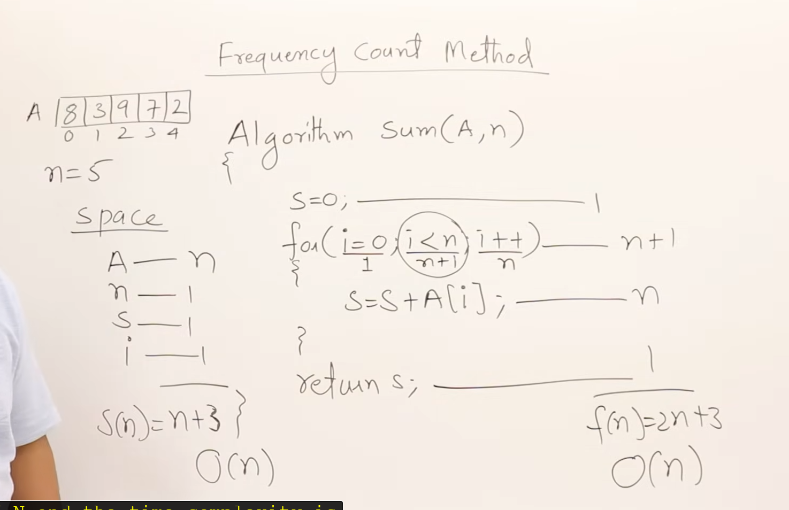
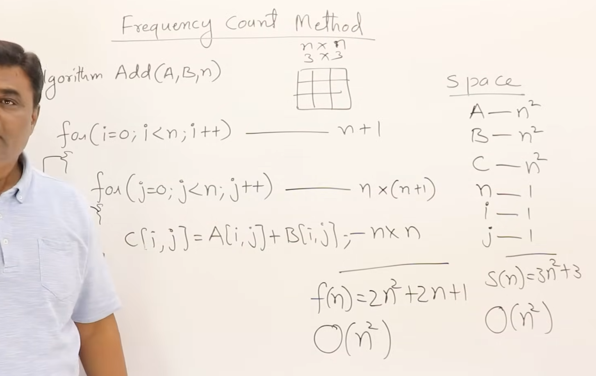
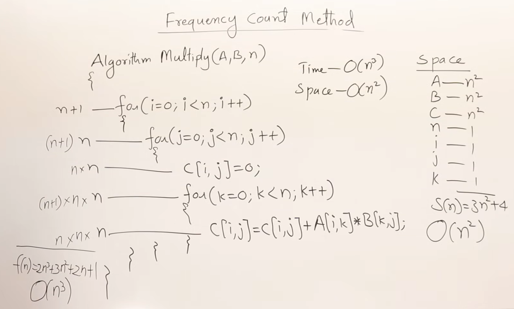

# 1.4 Frequency Count Method

## Overview

This session introduces the Frequency Count Method, an analytical technique used to assess algorithm complexity, particularly focusing on time and space complexity through practical examples including array operations and matrix arithmetic.

## Frequency Count Method Explained

- **Concept Introduction**: The Frequency Count Method involves tracking the number of times each operation within an algorithm is executed to determine the total time complexity. Assign 1 uint of time to each operation, and sum these units to calculate the total time. If any operation is executed multiple times, we use its frequency to calculate the time taken.
- **Utility and Application**: This method is invaluable for understanding how changes in input size affect an algorithm's performance, making it a foundational tool for optimizing algorithms.

## Analyzing Algorithm Complexity

- **Time Complexity Analysis**:
  - The analysis quantifies how many operations an algorithm performs, often expressed in terms of `n`, where `n` is related to input size.
  - For each operation or statement, a unit of time is considered, and the total time is the sum of these units over all operations, adjusted for the number of times each is executed.
  
- **Space Complexity Analysis**:
  - This considers the total memory usage of an algorithm, including variables and necessary data structures.
  - The method evaluates both direct storage requirements (e.g., arrays or matrices) and auxiliary space (e.g., temporary variables).

## Examples of Complexity Analysis

### Array Summation

#### Sum() Code

```c
Algorithm Sum(A, n)
begin
    sum := 0
    for i := 0 to n-1 do
        sum := sum + A[i]
    return sum
end
```

#### Sum() Complexity


  
- **Time Complexity**: Linear (`O(n)`), as the sum operation is performed once for each element.
- **Space Complexity**: Linear (`O(n)`), dictated by the size of the array.

### Matrix Summation

#### Add() Code

```c
Algorithm Add(A, B, n) {
  for(i=0; i<n; i++)
    for(j=0; j<n; j++)
      C[i][j] = A[i][j] + B[i][j];
}
```

#### Add() Complexity



- **Time Complexity**: Quadratic (`O(n²)`), due to nested loops iterating through matrix dimensions.
- **Space Complexity**: Quadratic (`O(n²)`), reflecting the storage for two matrices.

### Matrix Multiplication

#### Multiply() Code

```c
Algorithm Multiply(A, B, n) {
  for(i=0; i<n; i++)
    for(j=0; j<n; j++) {
      C[i][j] = 0;
      for(k=0; k<n; k++)
        C[i][j] += A[i][k] * B[k][j];
    }
}
```

#### Multiply() Complexity



- **Time Complexity**: Cubic (`O(n³)`), due to three nested loops iterating through matrix dimensions.
- **Space Complexity**: Quadratic (`O(n²)`), reflecting the storage for three matrices.

## Summary

The Frequency Count Method offers a systematic approach to analyzing the performance of algorithms by providing clear metrics on time and space requirements. Understanding this method enables developers and analysts to write more efficient algorithms by directly addressing the factors that influence their performance, such as the number of operations and the size of data structures involved.
