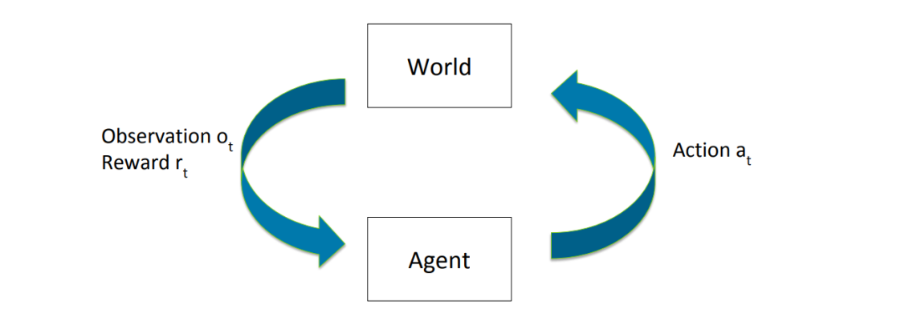
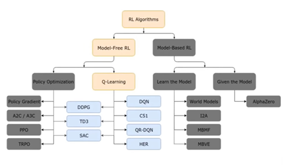

# Inrtroduction

In **Reinforcement Learning** (RL) we consider the problem of learning how to act, through experience
and without an explicit teacher. A **reinforcement learning agent** must interact with its world and from that learn how to maximize some cumulative reward over time.

For example, in game playing AlphaGo used Reinforcement Learning methods to reach superhuman
performance in Go, and Reinforcement Learning concepts are also often borrowed in the training
of Generative Adversarial Networks.

Based on the methods and way of learning, machine learning is divided into mainly four types, which are:

1. ***Supervised Machine Learning:*** is based on supervision. It means in the supervised learning technique, we train the machines using the "labelled" dataset, and based on the training, the machine predicts the output.
2. ***Unsupervised Machine Learning:*** here there is no need for supervision. It means, in unsupervised machine learning, the machine is trained using the unlabeled dataset, and the machine predicts the output without any supervision.
3. ***Semi-Supervised Machine Learning:*** is a type of Machine Learning algorithm that lies between Supervised and Unsupervised machine learning. It represents the intermediate ground between Supervised (With Labelled training data) and Unsupervised learning (with no labelled training data) algorithms and uses the combination of labelled and unlabeled datasets during the training period.
4. ***Reinforcement Learning:*** Reinforcement learning works on a feedback-based process, in which an AI agent (A software component) automatically explore its surrounding by hitting & trail, taking action, learning from experiences, and improving its performance. Agent gets rewarded for each good action and get punished for each bad action; hence the goal of reinforcement learning agent is to maximize the rewards. There is no labelled data like supervised learning, and agents learn from their experiences only.

Advantages in RL:

- It helps in solving complex real-world problems which are difficult to be solved by general techniques. 
- The learning model of RL is similar to the learning of human beings; hence most accurate results can be found.
- Helps in achieving long term results.

Disadvantages to RL:

- RL algorithms are not preferred for simple problems because of their complex nature.
- RL algorithms require huge data and computations.
- Too much reinforcement learning can lead to an overload of states which can weaken the results.

## Challenges with Reinforcement Learning

### Exploration-vs-Exploitation Tradeoff

- **_Exploration_:** It is more of a long-term benefit concept where it allows the agent to improve its knowledge about each action which could lead to long term benefit. Agents primarily focus on improving their knowledge about each action instead of getting more rewards so that they can get long-term benefits. So, in this technique, agents work on gathering more information to make the best overall decision.
- **_Exploitation_:** It is defined as a greedy approach in which agents try to get more rewards by using estimated value but not the actual value. So, in this technique, agents make the best decision based on current information. Here the agent’s current estimated value is exploited and chooses the greedy approach to get the most reward. However, the agent is being greedy with the estimated value and not the actual value, so chances are it might not get the most reward.

The key challenge that arises in designing RL systems, is in balancing the trade-off between exploration and exploitation, where
the agent needs to decide between potentially finding new, better strategies at the risk of a receiving a lower reward, or, if it should exploit what it already knows. In a stochastic environment, actions will have to be sampled sufficiently well to obtain an expected reward estimate. An Agent that pursues exploration or exploitation exclusively is bound to be less than expedient. It becomes worse than pure chance (i.e. a randomized agent).

## Components of RL

Reinforcement Learning deals with the problem of making a sequence of good decisions

| Symbol(s) | Definition/Use |
|---|---|
| $M$ | Model / Enviornment |
| $S$ | set of possible states in the world  |
| $\{s^t\}$ |  sequence of states observed, indexed by time |
| $A$ | set of possible actions in the world |
| $\{a^t\}$ | sequence of actions taken, indexed by time  |
| $\{o^t\}$ | sequence of observations noted, indexed by time  |
| $R(...)$ | Reward Function |
| $\{r^t\}$ | sequence of rewards (response) received, indexed by time  |
| $P( s_{t+1} \mid s_t, a_t, ..., s_1, a_1 )$ | transition dynamics (probability of next state given previous state of acttions) |
| $E[...]$ | Estimation |
| $h_t$ | History at time "t" (History is the set of previously visited states and actions) |
| $g(...)$ | Agent State Function |
| $\pi$ | Policy |
| $\gamma$ | Discount Factor |
| $V^{\pi}(...)$ | Value Function |

### Markov Property

In reinforcement learning, we often assume the Markov Property:

$$ P( s_{t+1} \mid s_t, a_t, ..., s_1, a_1 ) = P( s_{t+1} \mid s_t, a_t ) $$

that is, the next state in a model (with the Markov Propery) **ONLY** depends upon the current state $s_t$ and action $a_t$.

### Reward Function

A reward function is used to predict rewards. We consider the reward $r_t$ to be received on the transition between states, i.e. $s_t \rightarrow_{a_t} s_{t+1}$. It is given as the estimated reward given the current action, current state and next state:

$$ R(s, a, s') = E[ r_t \mid s_t=s, a_t=a, s_{t+1}=s' ] $$

we often represent this as:

$$ \Rightarrow R(s, a) = E[ r_t \mid s_t=s, a_t=a ] $$

$$ OR $$

$$ \Rightarrow R(s) = E[ r_t \mid s_t=s ] $$

It will also often be the case that $(r_t | s_t = s)$ is **degenerate**, that is, $r_t$ has a fixed value, given $s_t = s$.

## Components of a RL Agent

The **agent state** (current state of the agent) be a function of the history, $s^a_t = g(h_t)$. A reinforcement learning agent typically has an explicit representation of one or more of the following three things:

1. ***Policy*** [ $\pi$ ]: it is a mapping from the agent state $s_t$ to an action $a_t$.

    - **In Deterministic Distribution:** the policy takes a specific step w.r.t to a state. Hence, $\pi \left( s^a_t \right) \in A$ (state at time " $t$ " on action " $a$ " under the policy " $\pi$ ", returns an action belonging to the set of all actions " $A$ " in our enviornment).

    - **In Stochastic Distribution:** the agent picks an action $a \in A$ (set of all actions), with the Transition Probability $P(a_t=a) = \pi(a|s^a_t)$ (i.e. the probability of action " $a$ " given the state " $s^a_t$ " at time " $t$ ")

2. ***Value Function*** [ $V^\pi$ ]: is an expected sum of discounted rewards. Where $\gamma$ is the **Disount Factor** and has a value between [0, 1], it is used to weigh immediate rewards (when $\gamma = 0$) versus delayed rewards (when $\gamma = 1$). The Value Func is given as: 

$$ V^\pi(s) = E_\pi[r_t + \gamma^1r_{t+1} + \gamma^2r_{t+1} + ... | s_t=s] $$

   Where " $E_\pi[...]$ " denotes that the expectation is taken over states encountered by following the policy " $\pi$ "
3. ***Model*** [ $M$ ]: A **model** consists of the above Transition Dynamics $P(...)$ and Reward Function $R(...)$.  If the agent has a model, we would call it a **model-based agent**, and if it doesn't incorporate a model, we would call it a **model-free agent**. An illustration of a RL model:

## Observations vs State

## Types of RL Agents

| Agent Type | Poliy | Value Function | Model |
|---|:-:|:-:|:-:|
| Value Based |  ✅ (Implicit) | ✅ | ⬜ |
| Policy Based | ✅ | ❌ | ⬜ |
| Actor Critic | ✅ | ✅ | ⬜ |
| Model Based | ⬜ | ⬜ | ✅ |
| Model Free | ⬜ | ⬜ | ❌ |

✅ $\Rightarrow Yes$
⬜ $\Rightarrow Maybe$
❌ $\Rightarrow No$

## Continious domains VS Discrete States

