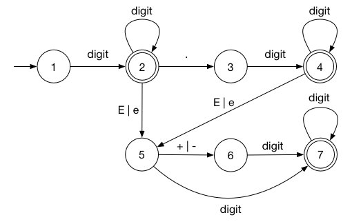

# Week 1: Lecture 1-3

## Lecture 1

Phonetics > Phonlogy > Morphology > Syntax > Semantics > Pragmatics

**Phonetics**: Phonetics is a branch of linguistics that studies how humans produce and perceive sounds.

**Phonology**: Phonology is the branch of linguistics that deals with systems of sounds.

**Morphology**: In linguistics, morphology is the study of words, how they are formed, and their relationship to other words in the same language.

**Syntax**: In linguistics, syntax is the study of how words and morphemes combine to form larger units such as phrases and sentences.

**Semantics**: Semantics is the study of reference, meaning, or truth.

**Pragmatics**: In linguistics and related fields, pragmatics is the study of how context contributes to meaning.

### N-grams

**Unigram**: Frequencies of Letters or Words

**Bigram**: Frequencies of Letters or Words given previous Letter or Word

**Trigram**: Frequencies of Letters or Words given 2 previous Letters or Words

## Lecture 2

- **Regular Expresion**: A regular expression is a sequence of characters that specifies a match pattern in text. Usually such patterns are used by string-searching algorithms for "find" or "find and replace" operations on strings, or for input validation.
- **Finite State Models**: A finite-state machine or finite-state automaton, finite automaton, or simply a state machine, is a mathematical model of computation. It is an abstract machine that can be in exactly one of a finite number of states at any given time.

- **context free grammar**: A context-free grammar is a set of recursive rules used to generate patterns of strings. Example of a rule: $S \rightarrow S * S$

- **Chomsky Normal Form**: a context-free grammar, G, is said to be in Chomsky normal form if all of its production rules are of the form: $A → BC$, or $A → a$, or $S → \epsilon$

- **Ambiguity**: Generating from grammar can create the same sentence with different parse tree.

- **Dependency Parsing**: Dependency parsing is a linguistic analysis technique used in natural language processing to uncover grammatical relationships between words in a sentence. It involves parsing a sentence's structure to create a tree-like representation that shows how words depend on one another.

## Leture 3

Applications of n-gram models:

- Language ID
  - Search ENgines
  - Indexers
- Text-to-speech
- Text Categorization
- Topic Segmentation
- Spelling Correction
- Speech Regognition
- Language Generation
- Machine Translation
