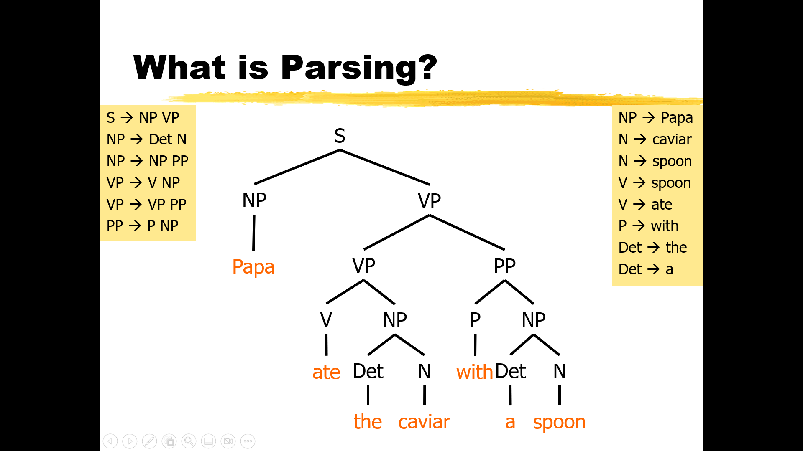
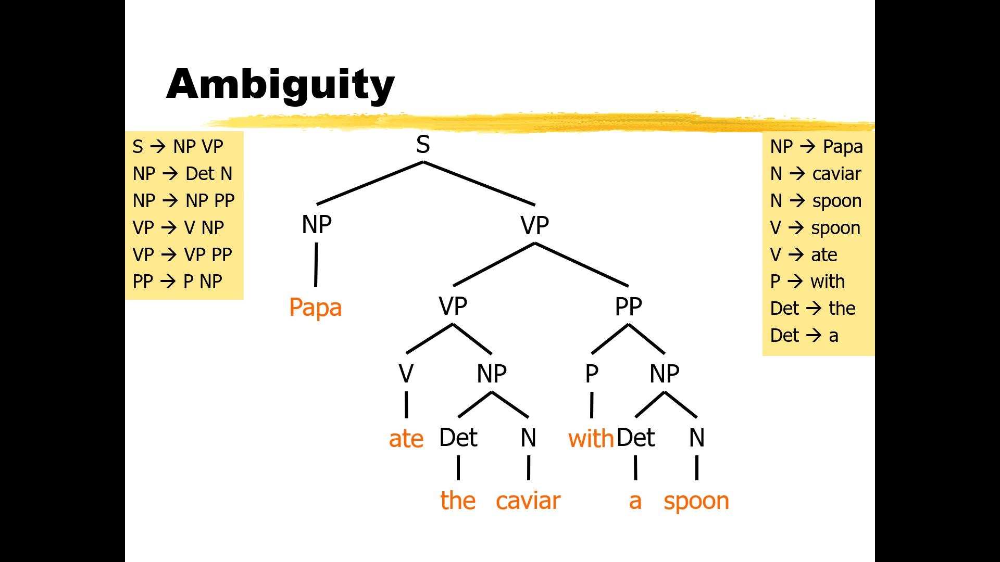
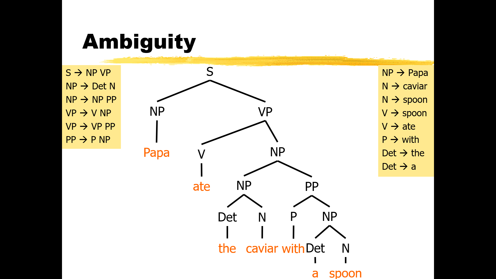
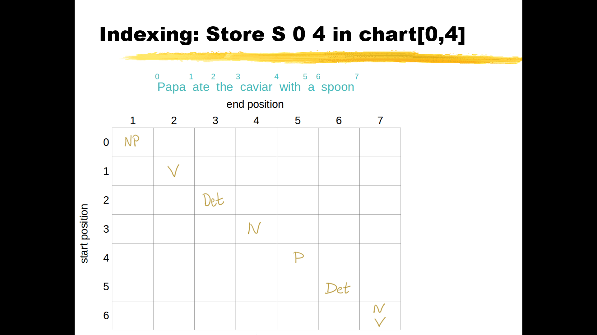
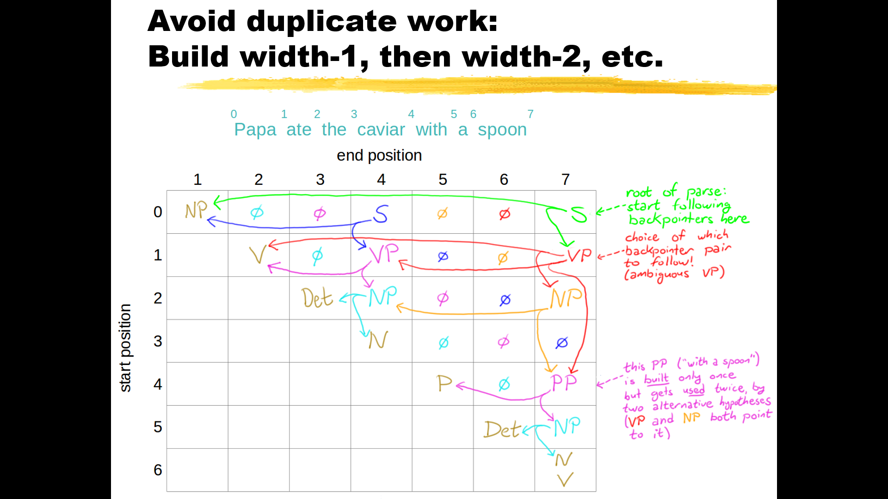
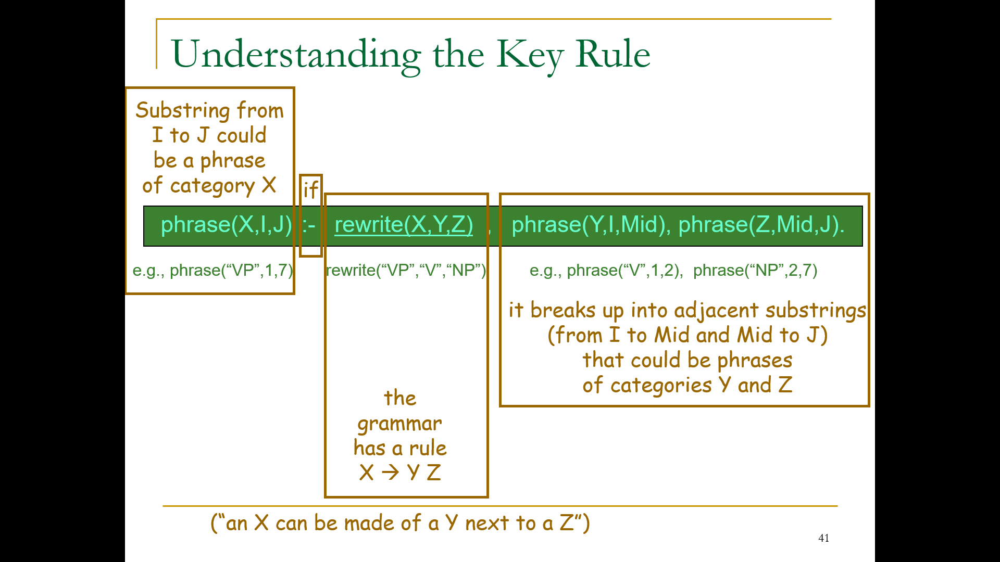

# Week 3: Lecture 6-13

## Lecture 6 : Syntax (Syntactic Attribtes)

### Part 1: Attributes and Variables

3 ways to think of a context free rule:

here is a list:

1. **Generation** (production): `S --> NP VP`
2. **Parsing** (comprehension): `S <-- NP VP`
3. **Verification** (checking): `S == NP VP`

An analogy of this would be in Object Oriented Programming (OOP) where a class is an interface and it has an implementation i.e. instantiated object.

Here `S` is the interface or class and `NP VP` is a particular object of the `S` class. The `S` class can rewrite to different objects.

But similar to OOP, we should pass some arguements to our object. Hence, we should not just have an `S` but different kinds of `S`'s so we should pass some auguements into `S` that create different objects, that themseles pass these arguements down to their children.

Doing this with CFG, instead of calling a class with arguements, we say that our non-terminal is *specialized* with some attributes attached. example:

$$S[tense=past]$$

#### Using Attributes

There are 3 common ways to use attibutes in CFG:

- **Morphology**: coordinates the spelling and pronunciation of word with attributes attached to the preterminal. example:
$$Verb[head=thrill, \ tense=present] \ \rightarrow Thrills$$

- **Projetion**: project attribute from one rule to another. Hence, when parsing from right to left, or generating from right to left the non-terminal on the left adopts the same attributes as the non-terminal on the right. eg:
$$VP[head=\alpha, \ tense=\beta, \ num = \gamma] \ \rightarrow V[head=\alpha, \ tense=\beta, \ num = \gamma] \ NP$$

- **Agreement**: between sister phrases. Hence, the attributes on the right need to agree to combine on the basis of some attribute (in the example below its the fact that both NP and VP are singular). example:
$$S[head=\alpha, \ tense=\beta] \rightarrow NP[num=\alpha, \dots] \ VP[head=\alpha, \ tense=\beta, \ num=\gamma, \dots]$$

TODO: Write about Generation and Parsing Example

### Part 2: Head Words

**Haed Words**: the "head word." is a constituent, in other words, a subtree of a tree. A head word is the most important part of a phrase

TODO : write about why we use Head words

Uses of head words:

1. Morphology
2. Subcategorization (transitive vs. intransitive)
3. Selectional Restrictions

TODO: Syntactic attributes for log-linear models

#### Log-Linear Models

$$p(NP[\dots],\ VP[\dots]\ |\ S[\dots]) = \frac{exp(\sum_k\ \theta_k \cdot f_k(S[\dots] \rightarrow NP[\dots],\ VP[\dots]))}{Z(S[\dots])}$$

### Part 3: Post-Processing

Sometimes, it can be beneficial to let your grammar do some, but not all, of the work. You could use your grammar to generate a form of the sentence that is close to what you want, but not quite there. Then, you can use a **post-processing step** to refine the sentence into its final form.

One advantage of this approach is that the grammar is very sensitive to the structure of **sub-trees**. Each sub-tree is generated *independently* from one another, which is essentially what context-freeness means.

However, if you use a **post-processor**, you can create rules where a part of one constituent affects a part of an adjacent constituent. This allows for more complex interactions between different parts of the sentence. Steps to compose grammer wih post-procssor:

1. Using CFG + randsent to generate some internal sentence
2. Do post-processing on that sentence.
3. The post-processor can fix up even more things accross constituent boundaries.

The post-processing device that can do this is known as a finite-state transducer. This tool can be used to transform the output of your grammar into the final sentence form that you desire.

#### Example: CAPS

It's a common rule that sentences start with capital letters, but this isn't always the case, even in English. For instance, consider the sentence "We will meet Smith 59, the chief." It starts with a capital letter. However, if we embed this sentence into a larger one, like "She wonders whether we will meet Smith 59, the chief," the word "we" wouldn't be capitalized because it's part of an embedded sentence.

Only the top-level sentence (the child of ROOT) starts with a capital letter and ends with a period. One way to describe this is by imagining a rule that says ROOT goes to S (sentence) preceded by a special symbol, the CAPS symbol, and followed by a period.

TODO: Add images

The CAPS symbol combines with whatever word shows up after it in post-processing to make a capitalized version of that word. It doesn't care about how deep the noun phrase is; it's just going to affect the first word of that noun phrase across the constituent boundary. This is how we can handle capitalization in sentences.

The CAPS symbol can also appear within a sentence, typically to capitalize proper nouns like "Smith." This can be represented in a rule where a proper noun starts with the CAPS symbol and continues with the noun, like "smith." In post-processing, this results in a capitalized "Smith."

Post-processing can also handle other aspects of sentence construction. For example, "we will" might optionally turn into the contraction "we'll." This involves the subject combining with the first word of the verb phrase, which is nested deep within the verb phrase.

Punctuation is another area where post-processing comes into play. Normally, words are separated by spaces, but if you have a comma, post-processing can attach it to the preceding token without any space. If you have two commas in a row or a comma followed by a period, these can be condensed into a single comma or period respectively.

Post-processing can also handle morphological changes. For example, when adding the "-ed" suffix to "meet," it doesn't become "meeted" but changes to the irregular past tense form "met." Similarly, the possessive form of "me" is not "me's" but "my," and the plural of "child" is not "childs" but "children."

All these modifications are handled by post-processing, allowing the context-free grammar to generate a more convenient form of the sentence that is then refined into its final form.

#### Cost of Enhancements

We have seen:

- Syntactic Attributes
- Post-processing

The use of attributes and post-processing in context-free grammars doesn't necessarily make it harder to parse sentences. In fact, they don't really add any cost because a context-free grammar with these extra features can be converted into an ordinary context-free grammar, albeit a larger one.

For instance, if we have a rule with variables ranging over finite sets, we could write out versions of this rule that specialize those variables to particular values. This results in a larger set of rules, but it's still finite, so we still have a context-free grammar.

Post-processing can also be converted into something that uses attributes. For example, the post-processor might change "a" to "an" before a vowel. We could represent this by having every non-terminal keep track of whether it starts with a vowel or not and require the determiner to agree with the following word or constituent.

These conversions reassure us that these enhancements don't allow us to build unnatural languages. They also mean that we can still use our old algorithms for computational purposes. If we want to parse something that we wrote using our new methods, we could just convert the grammar to an ordinary context-free grammar and give that grammar to the parser.

The benefit of using these extra techniques is that we get simpler grammars. It might be easier to attach probabilities to them because we've got fewer rules. It's more systematic and allows us to apply a pattern across multiple rules. So, in essence, these techniques offer a more efficient and systematic approach to handling language structures.

Indeed, these enhancements are not only beneficial for computational purposes but also for language learning, both in the context of theoretical and computational linguistics. Having fewer rules means that a language learner has fewer things to learn. A systematic system, with its consistent patterns and structures, is easier to grasp and understand. This makes the learning process more efficient and manageable. So, in essence, these techniques offer a more efficient and systematic approach to handling language structures, benefiting both computation and learning.

### Part 4: the English tense system

The "-s" in "she eats" is an operator that modifies the next verb by adding an "-s" to it. This is why we get "eats" when we put an "-s" on "eat", "has" when we put an "-s" on "have", and "is" when we put an "-s" on "be". These last two are irregular forms.

The "-ed" or "-en" ending is used to indicate the past participle. For example, the past participle of "jump" is "jumped", and the past participle of "be" is "been".

The "-ing" ending is used to indicate the present participle, which is very regular in English. For example, if we put "-ing" on "jump", we always get "jumping". If we put "-ing" on "be", we get "being", and if we put "-ing" on "have", we get "having".

#### Affix-Hopping

Chomsky suggested that these endings should go before the verb because they are also related to the previous verb. In his formalism, things that were adjacent had an easier time influencing one another.

#### Attributes for Post-Processing

We can also describe these patterns using attributes. For example, in the sentence "has been thrilling", at the top level, we have a present-tense thrill. This present tense is actually a present perfect tense, indicating a completed action. The kind of perfect that we have is perfect progressive, indicating an ongoing action that will be completed. This results in a progressive thrill, which pops out as a word at the bottom as "thrilling".

This approach allows us to handle different tenses and aspects systematically and efficiently. The English tense system, while systematic, can be complex and sometimes doesn't follow the expected patterns. For instance, while you might expect to be able to say "is having thrilled" or "will be having been thrilling" based on the rules of tense formation, these constructions are not actually allowed in English.

This suggests that there's a certain order or hierarchy to how these tenses can be combined. For example, you can have a perfect progressive tense ("has been thrilling"), but not a progressive perfect ("is having thrilled").

This order might be something that needs to be handled by additional features or by a language model. It could also be governed by some other mechanism that dictates the sequence in which you're allowed to apply rules. This would mean that the system is not entirely context-free.

As a child, you might have intuitively understood this order without being able to articulate it, as in your anecdote about saying "have had gone." While this construction might feel like it should be even further in the past than "had gone," it's not a construction that's typically used in English.

So while the rules for forming tenses in English can be described systematically, there are nuances and exceptions that make the system more complex than it might initially appear.

The English tense system for verbs is systematic but can be complex to capture with a context-free grammar. Let's consider the verb "to eat" as an example. It has irregular forms: "eat," "ate," "eaten," and "eating."

The basic tenses are present ("she eats"), past ("she ate"), future ("she will eat"), and infinitive ("to eat" or the bare infinitive "eat" as in "she makes her dog eat").

We also have the perfect aspect, which indicates a completed action: "she has eaten" (present perfect), "she had eaten" (past perfect), "she will have eaten" (future perfect), and "she wants to have eaten" (infinitive perfect).

The progressive aspect indicates an ongoing action: "she is eating" (present progressive), "she was eating" (past progressive), "she will be eating" (future progressive), and "she wants to be eating" (infinitive progressive).

You can also combine these aspects: "she has been eating" (present perfect progressive), "she had been eating" (past perfect progressive), "she will have been eating" (future perfect progressive), and "she wants to have been eating" (infinitive perfect progressive).

These tenses are formed using auxiliary verbs and sometimes unexpected verb endings. Noam Chomsky explained this using a post-processing mechanism. For example, in the sentence "Mary jumps," the "-s" ending is actually placed before the verb and fixed up by post-processing.

This approach allows us to handle different tenses and aspects systematically and efficiently.

The English tense system, while systematic, can be complex and sometimes doesn't follow the expected patterns. For instance, while you might expect to be able to say "is having thrilled" or "will be having been thrilling" based on the rules of tense formation, these constructions are not actually allowed in English.

This suggests that there's a certain order or hierarchy to how these tenses can be combined. For example, you can have a perfect progressive tense ("has been thrilling"), but not a progressive perfect ("is having thrilled").

This order might be something that needs to be handled by additional features or by a language model. It could also be governed by some other mechanism that dictates the sequence in which you're allowed to apply rules. This would mean that the system is not entirely context-free.

As a child, you might have intuitively understood this order without being able to articulate it, as in your anecdote about saying "have had gone." While this construction might feel like it should be even further in the past than "had gone," it's not a construction that's typically used in English.

So while the rules for forming tenses in English can be described systematically, there are nuances and exceptions that make the system more complex than it might initially appear.

### Part 5: Gaps

## Lecture 8 : Parsing CKY

### What is parsing

A parser in NLP uses the grammar rules to verify if the input text is valid or not syntactically. The parser helps us to get the meaning of the provided text. As the parser helps us to analyze the syntax error in the text; so, the parsing process is also known as the syntax analysis or the Syntactic analysis.



Where Programming Laguages are easy to parse (and in linear time) Programming Languages can be parsed in linear time from left to right. eg: some parsing techniques like LR parsing, SLR parsing. Natural Language is hard to parse as there are no set grammar rules, no parenthesis, no scope or precidence and lots of overloading.some of the issues in paring language are:

- No parenthesis to indicate precedence
- **Overloading** is an issue, where a symbol can mean different things (eg: Bet).
- Not knowing grammar in advance (grammar keeps evolving)
- CFG is not best formalism.

First we pars into syntax tree and then then parse semantics.

### Parsing Problem

We send our test sentences into into parsers and compare to our test sentences to score our parser. Scoring techniques:

- **Exact Match**: 1 or 0
- **Partial Credit**: Looking into what got attached to wrong things

Modern parser are pretty good, some of their applications are:

- Parsing sentence + Parts of Speech (POS) using some probabalistic model.
- Processing Downstream Tasks

### Ambiguity

Ambiguity is a type of meaning uncertainty giving rise to more than one plausible interpretation. Being ambiguous is therefore a semantic attribute of a form (a word, an idea, a sentence, even a picture) whose meaning cannot be resolved according to a rule or process with a finite number of steps.

Parse 1:


Parse 2:


Pence the parsing problem is defined as giving different sentences to a parser, and scoring the arse with respect to their respective best parse to get the accuracy

### Applications

- Machine Translation
- Speech Synthesis from parses
- Speech Recognition using parsing
- Grammar Checking
- Indexing for Information Retrival
- Inormation Extraction (for databases)

### Algorithm

Liguistic properties are defined over trees and one needs to parse to make subtle distinctions. Parsing also gives us the semanics of order (**Compositional Semantics**). Eg: what is the parse of $5*(6+2/4)$

Making Parsing Algorithm:

- Parse all terminals to their pre-terminals
- List each constituent in the format (`left_index`, `right_index`, `terminal`)
- if there are 2 adjacent terminals such as (`A`, `i`, `MID`) and (`B`, `MID`, `j`) and a grammar rule $Z \rightarrow A \ B$, then combine constituents in nonterminals (`Z`, `i`, `j`).
- Keep running this loop untill we parse the entire sentence.
- If get stuck at some terminal that doesnot combine with any adjacent terminals, then backtrack and try another rule.

Problems:

- Duplicate work ,we keep checking the same pairs
- Findinf new pairs are expensive as we look at rules list again and again.

To solve this we use a Parse chart

### Parse Chart

Now, we use this tabe to visualize our parsing:



Where the contituents on the diagnal are the non-terminals and any elements to the right of this diagnal (at position `i` and `j` of the table) are the possible combinations of nontermnials from the index `i` to `j` in the sentence.



For example $VP$ at position (1,4) is is the cominaion of all constituents from 1 to 3 in the sentence.

We construt these consitioents by decreasing width from the diagnal to avoid duplicates

### CYK Recognizer Algorithm

Aruguements:

- **Input**: string of `n` words.
- **Output**: Yes/no (only a recognizer)
- Data Structure: `n`x`n` table

The rows are labeled 0 to n-1, columns are 1 to n, cell [i, j] lists constituents found between i and j. Width = diagnol. Basic Idea: Fill cells of width-1 first then width-2 and so on.

Base Algo (Recognizer Version):

```ps
for end := 1 to n
    Add to [end-1, end] for all categories of the Jth word
for width := 2 to n
    for start := 0 to n-width           // This is I
    Define end := start + width         // this is J 
    for mid := start+1 to end-1         // find all I-to-J phrases 
        for every nonterminal Y in [start,mid] 
            for every nonterminal Z in [mid,end] 
                for all nonterminals X 
                    if X -> Y Z is in the grammar then add X to [start,end]
```

Optimized Base:

```ps
for J := 1 to n
    Add to [J-1, J] for all categories of the Jth word
for width := 2 to n
    for start := 0 to n-width           // This is I
    Define end := start + width         // this is J 
    for mid := start+1 to end-1         // find all I-to-J phrases 
      for every nonterminal Y in [start, mid]
          for every X -> Y Z is in the grammar
            if Z in [mid, end]
              then add X to [start, end]
```

Alternate Version with inner loop:

```ps
for J := 1 to n
    Add to [J-1, J] for all categories of the Jth word
for width := 2 to n
    for start := 0 to n-width           // This is I
    Define end := start + width         // this is J 
    for mid := start+1 to end-1         // find all I-to-J phrases 
        for every X -> Y Z is in the grammar
          if Y in [start, mid] and Z in [mid, end]
            then add X to [start, end]
```

Incremental left-to-right parsing?

Full CYK:

```ps
for J := 1 to n
    Add to [J-1, J] for all categories of the Jth word
for width := 2 to n
    for start := 0 to n-width           // This is I
    Define end := start + width         // this is J 
    for mid := start+1 to end-1         // find all I-to-J phrases 
        for every nonterminal Y in [start, mid] 
          for every nonterminal Z in [mid, end] 
            for every X -> Y Z is in the grammar 
              add X to [start, end]
```

Incremental CYK:

Visit columns left to right and fill each bottom-up.

```ps
for J := 1 to n
    Add to [J-1, J] for all categories of the Jth word
for width := 2 to n
    for start := 0 to n-width           // This is I
    Define end := start + width         // this is J 
    for mid := start+1 to end-1         // find all I-to-J phrases 
        for every nonterminal Y in [start, mid] 
          for every nonterminal Z in [mid, end] 
            for every X -> Y Z is in the grammar 
              add X to [start, end]
```

### What is space and Runtime

### Dyna

```pc
phrase(X,I,J):-  rewrite(X,W), word(W,I,J).
phrase(X,I,J):-  rewrite(X,Y,Z), phrase(Y,I,Mid), phrase(Z,Mid,J).
goal         :-  phrase(start_symbol, 0, sentence_length).
```



We give a rule and corresponding phrases to combine into pharse that has a larger span. A phrase that covers the whole sentence is a parse.

### Procedural Algorithm

The Dyna program runs fine.
It nicely displays the abstract structure of the algorithm.  

But Dyna is a declarative programming language that hides the details of the actual execution from you.
If you had to find the possible phrases by hand (or with a procedural programming language), what steps would you go through?

## Lecture 10 : Earley's Algorithm

Features of Earley's Algorithm:

- It is able to work with either left recursive or right recursive grammar that other parsers (recursive descent and bottom up parsers) have a hard time dealing with.
- It works with ambigious grammar (multiple parses)
- Allows for good error reporting.

Disadvantages of Earley's Algorithm:

- it's not efficient O(n^3) for ambigious grammar O(n^2) oherwise. while alternatives are O(n) in best case.

### Overview

Earley's Algorithm only parses from left to right and is contraint by it. this causes it to save time by not building impossible things.

for impllementing Earley's Algorithm:

- Find full and partial constituents (e.g. $A \rightarrow B \ C \ . \ D \ E$)
- Proceed incrementally from left to right, before reading word **'n'**, we have already created all hypothesis for words **'n-1'**
- Attaching the hypothesis of D to $A \rightarrow B \ C \ . \ D \ E$ gives $A \rightarrow B \ C \ D \ . \ E$.
- For a sentence of length 'n' we creeate 'n+1' numbered divisions between and around the words.

**Recursive Descent** fails with **Left Recursion** as our stack gets overflowed from infinite expansion.

### Changing to appropriate grammar

Left Recursion can be converted into **Right Recursion** by changine specific rules, example:

$$
VP \rightarrow V \ NP\\
VP \rightarrow VP \ PP
$$

above is a grammar with Left Recrsion, which can be converted by introducing some new nn-terminals and rules:

$$
VP \rightarrow V \ NP\\
VP \rightarrow V \ NP \ PPlist\\
PPlist \rightarrow PP\\
PPlist \rightarrow PP \ PPlist\\
$$

Even after doing this, parsing could be very slow (solving the same NP problem). Hence we need **Dynamic Programming** to speed things up.

### Parse Table

Similar to CKY parsing, we can look up anythin we have created so far to combine (dynamic programming).

**Vernacular**: Entries in column $5$ looks like $(3, S \rightarrow NP \ . \ VP)$ this means that the input substring from 3 to 5 matches the initial NP portion of the $S \rightarrow NP \ VP$ rule. The Dot (.) shows how much of the rule has been matches in that specific column. This means that some dotted rule back in Column 3 is looking for an $S$ that starts at 3. Hence if we are able to find a $VP$ starting in column 5 we will be able to attach $S$ to something.

In short Top-Down (Goal-Directed) parser does not start building because of input but because of context needs. Operations of algorithm:

- Process all hypothesis one at a time. This might lead to new hypothesis being formed orold ones being reused dependent on what fits the next word Process a hypothesis according to what follows the dot – just as in recursive descent:
- **SCAN**: See if terminal word matches input
- **PREDICT**: For nonerminals, find ways to match it (can look ahead to only select appropriate options)
- **ATTACH**: if there is nothing more to attach then we say that we have a complete constituent that can be attached to the previous incomplete constituent.

All entires ending at $j^{th}$ index of sentence are stored in $j^{th}$ column.

### Left Recursion vs Top-Down Parsing

### Complexity

## Lecture 11 : Weighted Probabalistic Parsing Parsing CKY

## Lecture 12

## Lecture 13
