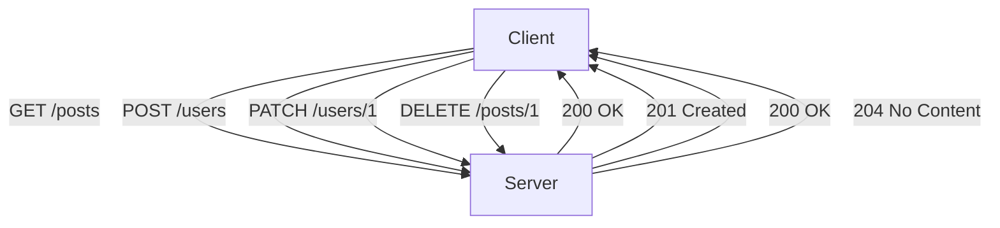
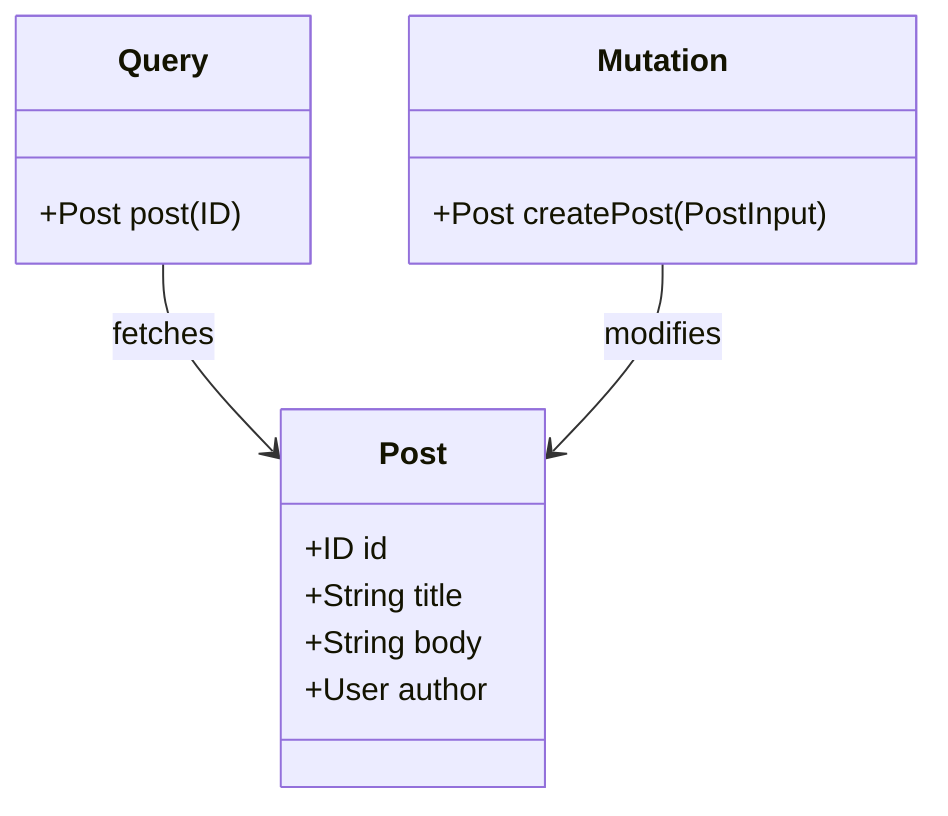
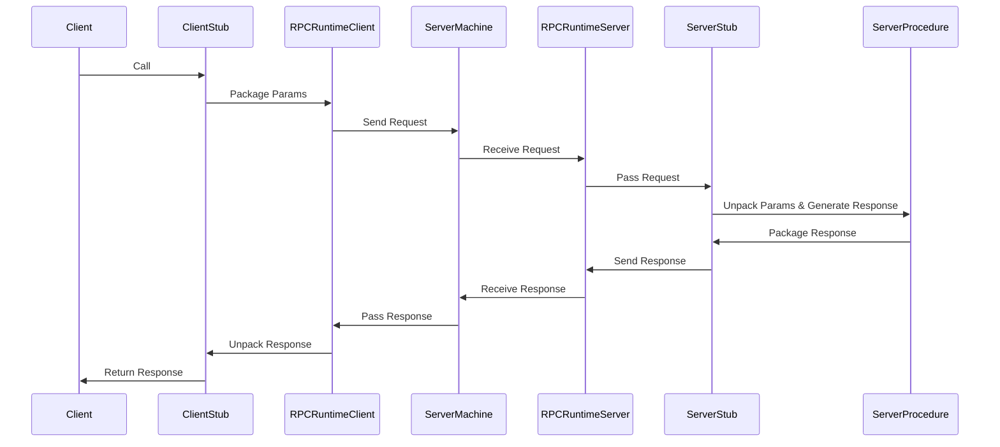

# API Design

## Part 1

### API Basics

- **Definition**: APIs are rules defining software interactions, supporting communication and functionality sharing.
- **Purposes**: Integration, automation, and efficiency in data transfer.

### Impact & Importance

- APIs enable modularity, foster innovation, and support scalable, high-performance applications.

### Types of APIs

- **Web APIs**: Communicate over the web using HTTP/HTTPS.
- **Library-based APIs**: Offer tools for software development.
- **Operating System APIs**: Interact with OS services.
- **Database APIs**: Facilitate CRUD operations on database records.

### Web APIs Deep Dive

- Types: Open, Internal, Composite, Partner APIs.
- Introduction to the web's functioning, emphasizing the distinction between the Web and the Internet.
- The architecture of the Internet includes end devices, intermediate devices, networks, connection types, and services like DNS and CDN.

### HTTP Fundamentals

- Basics of HTTP as a protocol for web communication and API construction.
- HTTP verbs (GET, POST, PUT, DELETE, etc.) indicate actions on resources.
- HTTP responses include status codes, headers, and body content to convey outcomes.

### Session Management

- Discussion on HTTP's stateless nature and the shift towards stateful communication for enriched user interactions.
- HTTP sessions facilitate continuity across multiple interactions, leveraging cookies and tokens.

```mermaid
graph TD;
    Client -->|Requests| Server;
    Server -->|Responds| Client;
    Client[Client (Browser/Device)];
    Server[Server (API)];
```

These notes encapsulate the foundational concepts, use cases, and detailed exploration of Web APIs and their crucial role in modern software development, providing a structured framework for understanding and designing effective APIs.

---

## Part 2 Summary

### API Design Principles

- Focus on creating **efficient**, **scalable**, and **user-friendly** APIs.
- Incorporate **best practices** and **guidelines** for robust API construction.

### API Design Patterns

- Implement **reusable solutions** to common API design challenges.

### API Design Tools

- Utilize **software tools** and **platforms** for efficient API development.

### API Design Documentation

- Ensure **comprehensive documentation** for clear understanding and usage of APIs.

### Types of Web APIs

- **RESTful APIs**: Adhere to REST (Representational State Transfer) principles.
- **GraphQL APIs**: Allow clients to request **specific data**, reducing over and under-fetching.
- **RPC APIs**: Facilitate communication through **Remote Procedure Calls**.
- Specialized APIs like **Webhooks** and **WebSockets** for specific use cases.

### RESTful API Design

- RESTful APIs are stateless, scalable, and cacheable, providing a standardized way to interact with resources.
- **Statelessness**, **Client-Server Architecture**, **Uniform Interface**, and **Layered System** are core principles.
- Resource naming uses URIs with nouns and plural forms for collections.
- CRUD operations are performed using HTTP methods (POST, GET, PUT/PATCH, DELETE).

### CRUD Operations and Resource Naming

- Design URIs that are intuitive and reflect the resource hierarchy.
- Use HTTP methods appropriately for creating, reading, updating, and deleting resources.

### Error Handling

- Deliver **clear error messages** and use standard HTTP status codes for easy troubleshooting.

### When to Use RESTful APIs?

- Ideal for applications requiring **CRUD operations**, **stateless architecture**, and **scalability**.
- Suitable for **public APIs** with a broad client base and when **caching** is beneficial.

### RESTful API Design: Best Practices

- Use **nouns** for resource representation and keep names **plural**.
- Employ **sub-resources** for hierarchical relations.
- Ensure **clear** and **informative** error messages alongside accurate status codes.



---

## Part 3 Summary

### GraphQL API Design

- **GraphQL** is a query language designed for APIs, offering a runtime for executing queries with a focus on making data fetching more efficient and powerful.

#### Key Concepts

- **Schema**: Acts as a contract between client and server, defining types, queries, and mutations.
- **Resolvers**: Functions that fetch and return data for a specific field to the client.
- **Querying**: Enables clients to specify exactly what data they need.
- **Mutations**: Allow for creating, modifying, or deleting data.
- **Subscriptions**: Support real-time data updates to clients.

#### GraphQL Schema Example



#### Use Cases

- Suitable for applications needing to fetch nested or complex data in a single request.
- Ideal when reducing the number of requests and minimizing data over-fetching or under-fetching is crucial.
- Beneficial for APIs requiring real-time data updates and where the schema frequently evolves.

#### GraphQL vs. RESTful APIs

- GraphQL allows precise data fetching, reducing over and under-fetching compared to REST.
- Single request in GraphQL can retrieve all needed data, contrasting with multiple requests in REST.
- RESTful APIs are more cacheable due to standardized HTTP methods, unlike GraphQL's custom query structure.

#### When to Use GraphQL?

- For complex systems with interrelated data.
- When frontend teams require flexibility in data retrieval.
- For real-time data updates and evolving API schemas.

#### Best Practices

- Define a **clear and concise schema**.
- Optimize queries and mutations **for the client's needs**.
- Use **descriptive names** for fields and operations.
- Implement effective **error handling**.

---

## Part 4 Summary

### RPC APIs Overview

- **RPC** enables function calls across a network, making remote calls feel like local ones.

#### Key Concepts

- **Interface Definition Language (IDL)**: Used to define the API in a language-independent manner.
- **Client and Server Stubs**: Auto-generated code handling request and response transmission.

#### RPC Workflow



#### RPC Shortcomings

- Tight coupling to the system architecture.
- Low discoverability and difficulty in debugging.

#### Comparison with REST and GraphQL

- **RPC vs. REST**: RPC is procedure-oriented, while REST uses HTTP methods for resource-based interactions.
- **RPC vs. GraphQL**: GraphQL offers more flexibility in data fetching, whereas RPC is procedure-oriented.

#### When to Use RPC

- For applications prioritizing function calls over resource manipulation.
- Where efficiency and performance outweigh the benefits of HTTP overhead minimization.

#### gRPC Introduction

- **gRPC** is a modern, high-performance RPC framework, supporting multiple programming languages and optimized for microservices.

#### Implementing and Using gRPC

- Example codes for server and client side in Node.js, illustrating basic gRPC usage.

#### When to Use gRPC

- Ideal for microservices communication, requiring low latency and high throughput.

#### Notable RPC Implementations

- **Apache Thrift**, **SOAP**, and **tRPC** are other implementations, each with unique features suitable for different scenarios.
